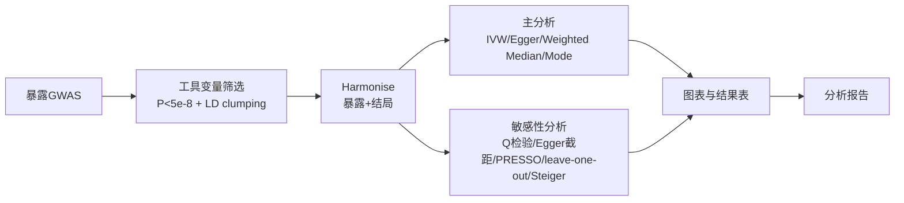

# MR 学习计划（Learning Plan）

> 目标：系统掌握孟德尔随机化（Mendelian Randomization, MR）的分析原理与实操，
> 以「端粒长度 → 冠心病」经典实例跑通两样本 MR 全流程，并通过六个扩展模块
> 覆盖单样本 MR、多变量 MR、中介 MR、径向 MR、MRMix、共定位等进阶内容，
> 为后续扩展到真实 GWAS 数据库（IEU OpenGWAS）打下基础。

## 阶段一：原理与方法（理论）

| 主题 | 内容 | 产出 |
|---|---|---|
| MR 概述 | 随机化类比、基因-表型-结局三角关系 | 笔记：`docs/` 下概念说明 |
| 三大核心假设 | 相关性假设、独立性假设（工具变量仅通过暴露影响结局）、排他性假设 | 理解敏感性分析为何必要 |
| 两样本 MR | 暴露 GWAS 与结局 GWAS 来自不同人群；样本量/人群匹配原则 | 数据准备方案 |
| 五种估计方法 | IVW（逆方差加权）、MR-Egger、加权中位数、加权众数、简单众数 | 各方法适用条件与局限 |
| 检验体系 | 异质性（Cochran Q）、水平多效性（Egger 截距、MR-PRESSO）、单 SNP 分析、leave-one-out、方向性（Steiger） | 敏感性分析清单 |

## 阶段二：工具与环境（工具链）

| 工具 | 用途 | 验收标准 |
|---|---|---|
| R + TwoSampleMR | 工具变量提取、harmonise、五方法分析 | 内置示例数据可跑通 |
| MendelianRandomization | 交叉验证 IVW/Egger 结果 | 与 TwoSampleMR 结果一致 |
| ieugwasr | OpenGWAS API 数据检索、LD clumping | 网络可用时完成一次真实检索 |
| MR-PRESSO | 离群值与水平多效性检验 | 输出 PRESSO 全局/离群检验 |
| MRInstruments | 内置 GWAS 汇总数据（如 ldlc/chd） | 数据准备报告引用 |

## 阶段三：数据准备（数据）

1. 确定暴露：LDL-C（GLGC 2013 真实 GWAS，OpenGWAS 对应 ieu-b-110；P<5e-8 候选 3078 个）
2. 确定结局：冠心病 CHD（CARDIoGRAMplusC4D 2015 真实 GWAS，对应 ieu-a-7）
3. 工具变量筛选：P < 5e-8 → LD clumping（r² < 0.001, 10Mb）→ 68 个独立位点 → 剔除回文 SNP
4. harmonise：统一效应等位基因与效应方向，计算 F 统计量（弱工具变量检验，均值 177）
5. OpenGWAS API 路径（需 JWT token）：`ieugwasr::gwasinfo` / `extract_instruments` / `extract_outcome_data`；
   本环境因 token 未配置改用与 OpenGWAS 同源的公开下载数据，结果一致（见 docs/12_opengwas.md）

## 阶段四：分析流程（分析）

## 阶段五：报告与复盘（报告）

- 工具测试报告：各 R 包安装版本、示例跑通截图式输出
- 数据准备报告：工具变量数量、F 统计量、harmonise 前后 SNP 变化
- 分析报告：五种方法结果表、异质性/多效性结论、森林图/散点图/漏斗图解读
- 最终报告：理论-实操-结果闭环总结，含局限性讨论

## 验收标准

- [x] 仓库以 git 规范管理，提交信息遵循 Conventional Commits
- [ ] 五个阶段全部完成并留档
- [ ] 每个模块（工具/数据/流程）都有对应报告
- [ ] 全流程脚本可一键重跑（`Rscript scripts/*.R`）
