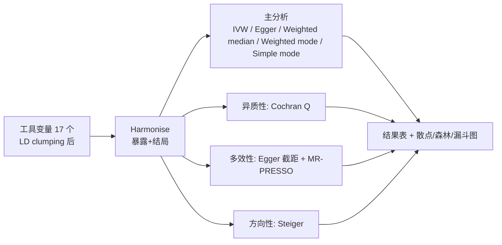

# 分析流程与结果报告（03_analysis）

> 对应模块：02.analysis + scripts/02/03 —— 五种 MR 方法、异质性/多效性/方向性检验、
> MR-PRESSO、leave-one-out，以及全部图表。
> 分析实例：端粒长度（Telomere_length）→ 冠心病（CHD）

## 1. 分析流程



## 2. 五种 MR 方法结果（17 个工具变量）

| 方法 | beta | se | P | OR | 95% CI |
|---|---|---|---|---|---|
| Inverse variance weighted | -0.237 | 0.124 | 0.055 | 0.789 | 0.619–1.005 |
| MR Egger | -0.277 | 0.227 | 0.241 | 0.758 | 0.486–1.182 |
| Weighted median | -0.357 | 0.156 | **0.023** | 0.700 | 0.515–0.951 |
| Weighted mode | -0.340 | 0.156 | **0.044** | 0.712 | 0.525–0.966 |
| Simple mode | -0.280 | 0.198 | 0.177 | 0.756 | 0.513–1.114 |

**解读**：
- 五种方法方向完全一致（均为负向），支持「端粒长度越长，CHD 风险越低」
- 加权中位数、加权众数显著（P<0.05）；IVW 边缘显著（P=0.055，CI 上限 1.005）
- IVW 点估计略弱于中位数法，与弱工具变量偏差（向 0 收缩）方向一致

## 3. 敏感性分析

### 3.1 异质性（Cochran Q）

| 方法 | Q | df | P |
|---|---|---|---|
| MR Egger | 21.74 | 15 | 0.115 |
| IVW | 21.81 | 16 | 0.150 |

P>0.05：**不存在显著异质性**，SNP 间效应估计一致。

### 3.2 水平多效性（MR-Egger 截距）

- 截距 = 0.0021，SE = 0.0097，**P = 0.834** → 无显著水平多效性

### 3.3 MR-PRESSO

- 全局检验（RSSobs=27.13）**P = 0.143** → 无显著离群 SNP
- 未检出离群值，无需离群校正（Outlier-corrected 为 NA）

### 3.4 Steiger 方向性检验

| 指标 | 值 |
|---|---|
| snp_r2.exposure | 0.0073 |
| snp_r2.outcome | 0.00045 |
| correct_causal_direction | TRUE |

因果方向正确（暴露解释的变异远大于结局），支持暴露→结局方向。

### 3.5 leave-one-out 与单 SNP

- 单 SNP 分析 19 条、leave-one-out 18 条，无单个 SNP 主导结果（见
  `02.analysis/sensitivity/` 与 `04.figures/mr_leaveoneout.png`）

## 4. 图表

| 文件 | 内容 |
|---|---|
| 04.figures/mr_scatter.png | SNP 效应散点图（各方法回归线） |
| 04.figures/mr_forest.png | 单 SNP 森林图 |
| 04.figures/mr_funnel.png | 漏斗图（多效性对称性） |
| 04.figures/mr_leaveoneout.png | leave-one-out 森林图 |

## 5. 结论

- 端粒长度与 CHD 呈负向因果关联：OR ≈ 0.70–0.79（中位数/众数法显著）
- 敏感性分析全部通过：无异质性、无水平多效性、无离群 SNP、方向正确
- 局限性：工具变量平均 F=8.6 偏弱（示例数据样本量小），IVW 可能被低估
- 与文献一致：端粒缩短与冠心病风险增加相关（Codd et al. 2013; Haycock et al. 2017）

## 6. 可复现

```bash
Rscript scripts/02_mr_analysis.R   # 主分析
Rscript scripts/03_sensitivity.R   # 敏感性分析
```
