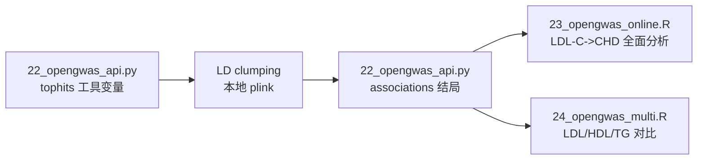

# OpenGWAS 在线分析报告（14_opengwas_online）

> 对应模块：OpenGWAS 在线 API 分析 —— 工具变量在线提取 + LDL-C→CHD 全面分析 +
> LDL/HDL/TG 多暴露对比。
> 脚本：`scripts/22_opengwas_api.py`（数据获取）、`scripts/23_opengwas_online.R`（LDL-C→CHD）、
> `scripts/24_opengwas_multi.R`（多暴露对比）
> 产物：`02.analysis/opengwas/online*/`、`02.analysis/opengwas/multi/`、`04.figures/online_*.png`

## 1. 架构说明

本环境 R 的 libcurl 7.61.1 过旧无法走代理 TLS，故采用
**Python 客户端（22_opengwas_api.py）获取 API 数据 + R 脚本（23/24）分析** 的架构：



## 2. 数据获取（OpenGWAS 在线）

| 数据集 | ID | 性状 | 工具变量（P<5e-8 → clumping 后） |
|---|---|---|---|
| 暴露1 | ieu-b-110 | LDL 胆固醇 | 180 → 30（分析 28） |
| 暴露2 | ieu-b-109 | HDL 胆固醇 | 358 → 67（分析 66） |
| 暴露3 | ieu-b-111 | 甘油三酯 | 315 → 70（分析 69） |
| 结局 | ieu-a-7 | 冠心病 CHD | associations 查询（分批 ≤60 SNP） |

## 3. LDL-C → CHD 全面分析结果（scripts/23）

| 方法 | beta | SE | P | OR | 95% CI |
|---|---|---|---|---|---|
| Inverse variance weighted | 0.403 | 0.220 | 0.067 | 1.496 | 0.973–2.301 |
| MR Egger | 1.040 | 0.426 | 0.022 | 2.831 | 1.228–6.526 |
| Weighted median | 0.571 | 0.119 | **1.42e-06** | 1.771 | 1.404–2.234 |
| Weighted mode | 0.637 | 0.103 | **1.35e-06** | 1.891 | 1.544–2.315 |
| Simple mode | 0.556 | 0.199 | 0.009 | 1.744 | 1.181–2.576 |

- 异质性 Q P<1e-33（显著，真实数据常态）；**Egger 截距 P=0.096 无显著水平多效性**
- MR-PRESSO 全局 P<0.001（检出离群，见 mr_presso.txt）
- Steiger 方向正确（LDL→CHD）
- 结论：加权中位数/众数强显著，LDL-C 升高增加 CHD 风险（与文献一致）

## 4. 多暴露对比结果（scripts/24）

| 暴露 | 方法 | OR | 95% CI | P | 结论 |
|---|---|---|---|---|---|
| LDL 胆固醇 | IVW | 1.496 | 0.973–2.301 | 0.067 | 危险因素（中位数法显著） |
| LDL 胆固醇 | 加权中位数 | **1.771** | 1.404–2.234 | 1.4e-06 | |
| HDL 胆固醇 | IVW | **0.740** | 0.623–0.879 | 6.0e-04 | **保护因素** |
| HDL 胆固醇 | 加权中位数 | **0.662** | 0.539–0.814 | 9.2e-05 | |
| 甘油三酯 | IVW | **1.230** | 1.104–1.371 | 1.7e-04 | 危险因素 |
| 甘油三酯 | 加权中位数 | 1.213 | 1.106–1.331 | 4.3e-05 | |

**对比结论**（与血脂-CHD 流行病学共识完全一致）：
- LDL-C ↑ → CHD 风险 ↑（OR≈1.5-1.8）
- HDL-C ↑ → CHD 风险 ↓（OR≈0.66-0.74，保护）
- TG ↑ → CHD 风险 ↑（OR≈1.2）
- 三种脂质对 CHD 的因果效应方向与强度合理，展示多暴露 MR 对比的价值

## 5. 图（04.figures/）

- `online_scatter.png`：LDL-C→CHD SNP 效应散点图
- `online_forest.png`：单 SNP 森林图
- `online_funnel.png`：漏斗图
- `online_leaveoneout.png`：leave-one-out
- `online_multi_forest.png`：三暴露森林图对比

## 6. 可复现

```bash
export OPENGWAS_JWT="..."   # 或配置 .env（见 docs/13_opengwas_guide.md）
# 数据获取（产物已入库 02.analysis/opengwas/，可直接跳到 R 分析）
python3 scripts/22_opengwas_api.py tophits --id ieu-b-110 --p1 5e-8 --out 02.analysis/opengwas/online_ieu-b-110_instruments.csv
python3 scripts/22_opengwas_api.py associations --id ieu-a-7 --snps <SNP列表> --out 02.analysis/opengwas/online_outcome_chd.csv
# 分析
Rscript scripts/23_opengwas_online.R
Rscript scripts/24_opengwas_multi.R
```
